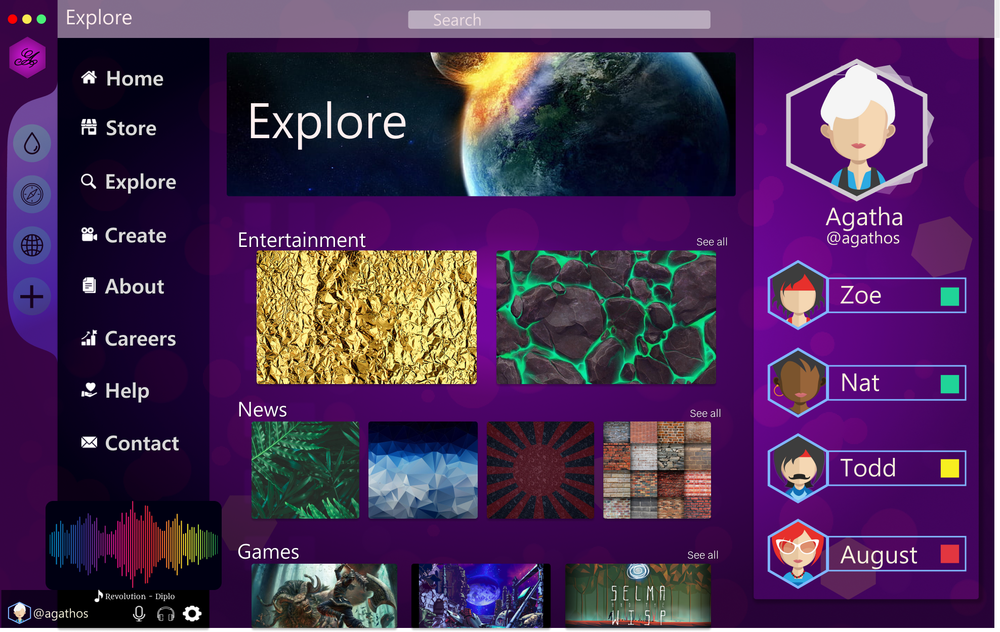

# Agathos - 3D Webpage Design

Welcome to the repository for Agathos, a 3D webpage design that leverages modern web and design tools to create an immersive online experience.


## About the Project

Agathos showcases the potential of 3D web design. The webpage was conceptualized in Figma, where the initial designs and user interface components were carefully crafted. Following the design phase, assets were optimized and prepared in Photoshop, ensuring that they were ready for high-quality animations.

The final animations and interactions were implemented using Spline, a powerful tool that brings the static designs to life in a dynamic 3D environment.

## Preview

Below is a screenshot from the Figma design phase, showing the layout and design elements that were developed for Agathos.



### Live Demo

For a real-time demonstration of the 3D animations and interactions, please check out the following video:


## Usage

To explore the design files or run the Spline animations locally, follow these steps:

1. **Clone the Repository**:
   ```bash
   git clone https://github.com/austinpapritz/agathos.git
   cd agathos
